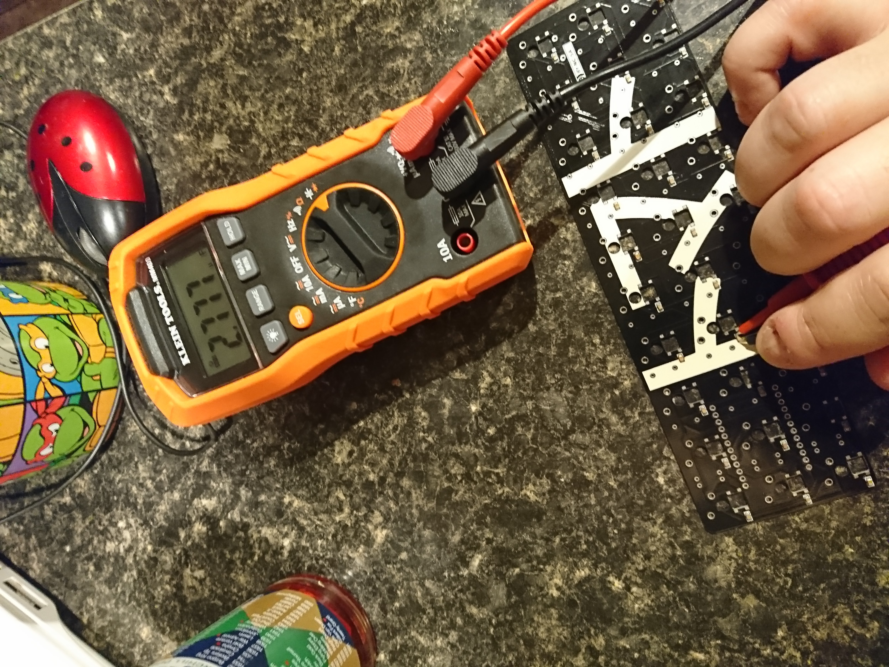
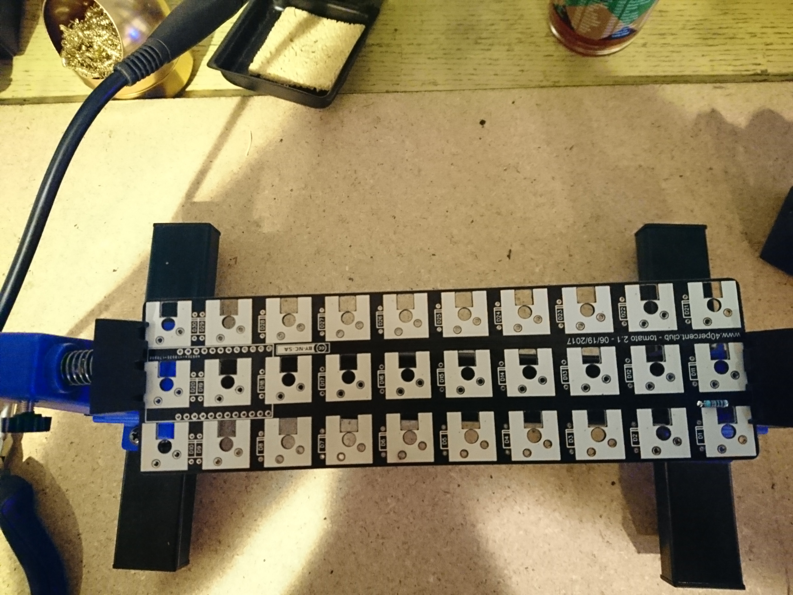

# byatk
Build You A Tomato Keyboard!

in which we build a ortholinear 30% keyboard with fully programmable RGB backlighting.
[This keyboard](http://www.40percent.club/2017/07/tomato-in-gherkin.html) is a variant of the (relatively) famous Gherkin keboard.

TL;DR solder things in the following order:
1. [Capacitors](#capacitors)
2. [Lights](#lights)
3. [Resistor](#resistor)
4. [Diodes](#diodes)
5. [Pro Micro pins](#pro-micro-pins)
6. [Switches](#switches)
7. [Pro Micro](#pro-micro)

# Capacitors

The capacitors are the hardest part of this whole build, and you get to do them first!
These are the tiny little rectangles that probably come in a cardboard strip, held in with tape.
They are SMD mounted, which basically means that they are little and to not bother soldering them...
unless you are a surgeon.

The good news is that all the capacitors wired to eachother (parallel circuit).
If you break one off or something it's no big deal, the others will pick up the slack.
The bad news is that all the capacitors wired to eachother (parallel circuit).
If you short one of them, then you short your entire lighting circuit.

There are basically four ways I know of to solder SMD components.
If you have more money (or time) than I do, you can buy (or make) a reflow oven.
A much cheaper, but non-free option is to get a hot air rework station.
If you are like a surgeon (soldering for the first time), then you can do them by hand with a soldering iron.
I used the skillet method. Literally a cast iron griddle on my gas powered kitchen stovetop.
This guide assumes the skillet method.
Check out the [sparkfun article called "Reflow Skillet"](https://www.sparkfun.com/tutorials/59) for more info.
If you want info on other methods, then I suggest google or youtube, or open a pull request ;-).

You will need tweezers, a small bowl, solder paste, and a hot flat surface.

First you apply the solder paste, then you can stick the capacitors to the paste.
The solder paste I ordered came in a syringe, but I found that dipping a toothpick into a glob of paste and then using the toothpick to apply the paste worked better than the syringe.
You really need very little paste.

Notice that the paste is gray from the metal in it. If your paste is yellow instead, then it won't work because it is just flux and not solder.

Dab a little solder on the pair of pads to the bottom left of each square hole.
Peel the tape off of your capacitor strip and dump the capacitors into a small bowl so that you don't lose any.
Then use the tweezers to place the capacitors.
They don't have to be perfect, they will flow into place when you melt the solder.

Once all your capacitors are placed, you can reflow the solder.
It seems the skillet method is usually used with smaller boards than this one.
You will want to make sure that your board lays flat (with the capacitors up) so it heats evenly.

Uneven heating can cause discoloration of your board.

I've had success using magnets and chopsticks to press the board flat.
I read that sand can be used to line your "skillet" as well to provide even heat.

Please remember as well that you are dealing with extremely toxic materials.
If you will be cooking food on your skillet thing, then you will want to line it with foil or something.

Apply heat to a cold board and skillet.
I used the large burner on medium heat.
It takes about 200C or 400F to reflow the solder.
First the flux (acid cleaner) will melt. This will make a dull puddle around the capacitors.
Next the actual solder will melt. When this happens the flux puddle will go away and the solder will turn shiny.

At this point you will want to remove the board from the heat.
Cooling it too quickly is supposed to be hard on the electronics.
You can put it on hot pad or towel or other surface that doesn't conduct heat well make sure it doesn't cool too fast.

Now you can test the capacitors.
Since they are in parallel, testing one is testing them all.
The thirty of them at 100 nano Farads a piece works out to around 3 micro Farads.
If you don't have the tools to test the capacitance, I highly recommend at least testing for a short.

# Lights

The lights fit into the sqare holes in the board.
If you have the kind with black faces, then you can orient them using the white corner.
Otherwise you can use the black spot visible through the little round window to orient them.
They should be oriented as in the picture below:

I like to think of it as making the white corner be as far from it's capacitor as possible.

The fit is actually pretty tight.
I find that keeping them very straight and flat while pushing them into their hole helps.
You can place all the lights at once and then solder them after.
There is really no danger of them falling out.

Even though these are technically SMD parts, I had little trouble soldering them by hand.

# Resistor
The resistor is the round stripped component. Probably beige or blue in color.
It goes in the place on your board labelled R1.
Orientation doesn't matter and you can put it on the top or bottom of your board as you please.
Simply bend the wires coming out of the resistor 90 degrees and then push them through the holes to either side of the R1 label.
Solder the side with the wires sticking out, and then snip the wires.
See bottom right in the image.

# Lighting Test
Now is a really really good time to test your lighting circuit.
Of the 6 boards I've seen built, 4 of them had issues with the lighting circuit.
They were all easily fixed at this stage, but would have sucked to fix later.

You may flash your microcontroller with the file [here](bin/WS2812_Breakout_Example.ino.hex).
To flash your microcontroller, you need to plug it into your computer and then short out the RST and GND pins.
This will put it into the mode where you can flash it.
In linux, I use the following command to flash the previously linked file.

`sudo  avrdude -C/etc/avrdude.conf -patmega32u4 -cavr109 -P/dev/ttyACM0 -b57600 -D -Uflash:w:WS2812_Breakout_Example.ino.hex:i`

I wouldn't mind having a section here for how to do this under Mac or Windows, if anyone wants to help me out.

Once the microcontroller has the lighting test firmware on it, you can wire up the VCC, GND and 9 pins to your board as shown:

If have any problems they should be pretty easy to spot.

Most likely you just forgot to solder a connection, or you have a weak solder joint.
Do not be discouraged. Just fix it up and try again.

# Diodes

The diodes orientation does matter.
Each diode has a stripe on one end.
If you look on the circuit board, then you will see that the spots for the diodes (D1, D2,...D29, D30) have a drawing of the diode with a matching stripe.
Bend the wires as you did with the resistor and place the diodes, ensuring that the stripe on the diode faces the same direction as the stripe on the board.
Top or bottom, it doesn't matter.

You can bend the wires out a bit after you stick them through so the diode stays in place.
This way you can place all the diodes at once, and then solder them all at once rather than doing one at a time.

If you are using a micro usb controller instead of a mini usb controller, then be sure to save the snipped diode pins.
You will need them for the next step.

# Pro Micro pins
The thing that is tricky here is that there are some switches _under_ the microcontroller.
So if you put on the microcontroller first, then you can't get the switches soldered, but if you solder the switches on, then you can't get to the pins on the top of the circuit board.
The solution is to solder the pins to the controller first, then the switches, then the controller itself.

If you have a micro usb controller, then the headers pins that come with it will be too thick.
The diode wires however work great!
Now is a good time to snap your switches into the top plate.
You can fit the top and middle pieces together and get the controller as close to the switch pins as possible to make sure you have enough clearance below the controller to place the bottom place on.

Once you've soldered the pins to the circuit board, then you can straighten them from the controller up.
This will release the controller so that you can solder the switches on.

# Switches
This may be the most significant step.
You must snap the switches into the top plate, and then solder them to the circuit board.
This permanantly affixes your top plate to the circuit board!
There is no going back from this, triple check your diodes to make sure they are correct.

# Pro Micro
This is the final soldering step.
Before you solder the controller on, be sure to take note of the RST and GND pins.
You'll need to know where they are to put firmware on the thing.

Make sure you measure carefully!
I didn't and I wound up wrecking one of my controller pins trying to fix it.
Now I have a crappy patch wire, and I have to maintain a separate branch of firmware just for this one board.

Don't be like me.
You can fit the top and bottom pieces together and use the standoffs to make sure you have enough clearance below the controller to place the bottom place on.

# Final Steps
Now that you've clipped the pins off of the controller and screwed the bottom plate and standoffs on, you only need to flash the controller with the keyboard firmware.

You may flash your microcontroller with the default QMK firmware [here](bin/tomato_default.hex).
Refer to the [Lighting Test](#lighting-test) section for instructions to flash firmware files.

QMK has a feature to bind a key on your board to put it in "bootloader" mode so that you can install firmware.
As of this writing, that feature is broken :-(
If you wanna get fancy, you can attach a switch to the reset and ground pins, so that you can flash new firmware.
If you are like me, you can just shove a screwdriver in there and short them out.

See [QMK](http://qmk.fm) and it's [documentation](https://docs.qmk.fm) for more information.