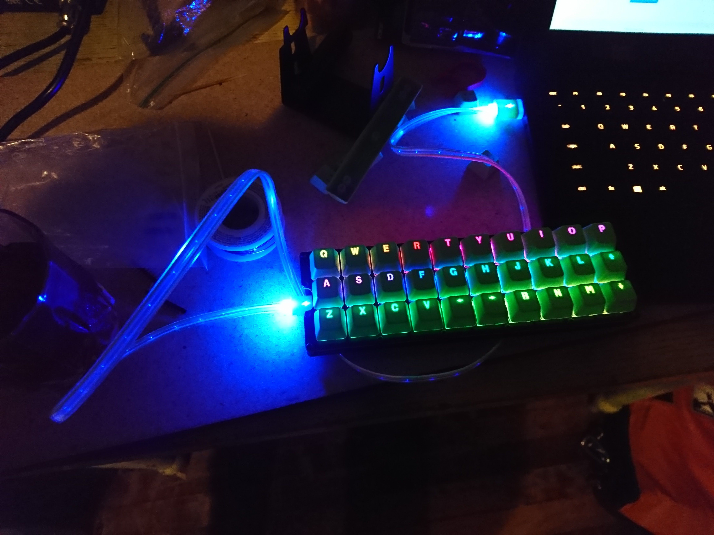

# byatk
Build You A Tomato Keyboard!

in which we build a ortholinear 30% keyboard with fully programmable RGB backlighting.
This keyboard is a variant of the (relatively) famous Gherkin keboard.

TL;DR solder things in the following order:
1. [Capacitors](#capacitors)
2. [Lights](#lights)
3. [Resistor](#resistor)
4. [Diodes](#diodes)
5. [Pro Micro pins](#pro Micro pins)
6. [Switches](#switches)
7. [Pro Micro](#pro Micro)

# Capacitors
# Pro Micro pins